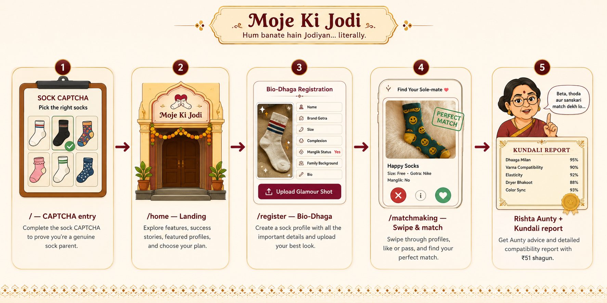

# Moje Ki Jodi

**Hum banate hain Jodiyan… literally.**  
*We make pairs… literally.*

India's most trusted matrimonial platform for lonely socks — an AI-powered, deadpan-serious parody of desi matchmaking sites, built as a creative hackathon-style web experience.

---

## Live demo

<iframe width="100%" height="480" src="https://www.youtube.com/embed/OBG3Fzbmepg" title="Moje Ki Jodi — Demo" frameborder="0" allow="accelerometer; autoplay; clipboard-write; encrypted-media; gyroscope; picture-in-picture; web-share" referrerpolicy="strict-origin-when-cross-origin" allowfullscreen></iframe>

**Watch on YouTube:** [https://youtu.be/OBG3Fzbmepg](https://youtu.be/OBG3Fzbmepg)

---

## The idea

Every year, billions of socks are separated from their partners. They linger in drawers, face laundry-basket judgment, and live in fear of becoming a cleaning rag. **Moje Ki Jodi** gives sock owners (acting as concerned parents) a sacred space to find the perfect **sole-mate** — blending textile astrology, matrimonial tropes, and modern swipe UX with zero irony in the UI copy.

---

## Features

| Feature | Description |
|--------|-------------|
| **Sock CAPTCHA gate** | Entry verification: pick the “right” socks (government job, sanskari, reputed gotra) before entering the site |
| **Bio-Dhaga registration** | Create a sock profile — name, brand gotra, complexion, size, Manglik status, family background, bio, glamour shot upload |
| **Swipe matchmaking** | Browse curated sock profiles; reject or accept to trigger a match |
| **Rishta Aunty** | Floating “aunty” with unsolicited, passive-aggressive matrimonial advice |
| **Pandit-Ji Kundali report** | Post-match ₹51 shagun compatibility certificate (Dhaaga, Varna, Elasticity, Dryer Bhakoot, etc.) |
| **Success stories & pricing** | Testimonial carousel plus Basic / Gold / Shaadi Deluxe tiers |

---

## How it works



1. **Entry (`/`)** — Complete a sock-themed image CAPTCHA to prove you are a genuine sock parent.
2. **Home (`/home`)** — Hero, stats, success stories, featured profiles, pricing, footer.
3. **Register (`/register`)** — Fill the Bio-Dhaga form and upload a glamour shot (UI flow; no backend persistence).
4. **Matchmaking (`/matchmaking`)** — Swipe through hardcoded profiles, match, then view compatibility report and Aunty tips.

---

## Tech stack

| Layer | Stack |
|-------|--------|
| **Framework** | React 18 + TypeScript |
| **Build** | Vite 5 |
| **Routing** | React Router DOM 7 |
| **Styling** | Tailwind CSS 3 (custom saffron / maroon / gold theme) |
| **Icons** | Lucide React |
| **Data** | Frontend-only; sock profiles and copy live in component state (e.g. `Matchmaking.tsx`) |

There is no backend or database — the experience is fully client-side for demo and presentation.

---

## Project structure

```
moje-ki-jodi/
├── src/
│   ├── pages/
│   │   ├── EntryPage.tsx      # CAPTCHA gate
│   │   ├── Homepage.tsx       # Landing & marketing
│   │   ├── Registration.tsx   # Bio-Dhaga form
│   │   └── Matchmaking.tsx    # Swipe UI + profiles
│   ├── components/
│   │   ├── Header.tsx
│   │   ├── Footer.tsx
│   │   ├── RishtaAunty.tsx
│   │   ├── MatchModal.tsx
│   │   ├── CompatibilityReport.tsx
│   │   ├── PricingSection.tsx
│   │   ├── TestimonialCarousel.tsx
│   │   └── UploadPopup.tsx
│   ├── App.tsx
│   └── main.tsx
├── index.html
└── package.json
```

---

## Getting started

### Prerequisites

- Node.js 18+ and npm

### Install and run

```bash
git clone https://github.com/avyakt06jain/moje-ki-jodi.git
cd moje-ki-jodi
npm install
npm run dev
```

Open [http://localhost:5173](http://localhost:5173) in your browser.

### Other scripts

```bash
npm run build    # Production build
npm run preview  # Preview production build
npm run lint     # ESLint
```

---

## Premium plans (in-app)

| Plan | Price | Highlights |
|------|-------|------------|
| **Basic** | Free | 3 swipes/day, standard matching |
| **Gold** | ₹21/month | Unlimited swipes, designer sock early access |
| **Shaadi Deluxe** | ₹101/month | Rishta Aunty consultation, compatibility reports |

---

## Success stories

> *"We lost hope after years in the laundry basket… until Moje Ki Jodi reunited us."* — The Striped Twins  

> *"Earlier, I was just a single sock. Now, I'm part of a power couple."* — Black Adidas (Right Foot)

---

## Legal disclaimer

- Moje Ki Jodi is not responsible for post-marriage color fading or shrinkage.
- We are not liable for pairs separated by pets, toddlers, or mysterious laundry phenomena.
- All disputes shall be settled in the **Laundry Court of India**.

---

## License

This project is a humorous demo / portfolio piece. Use and share with appropriate credit.
